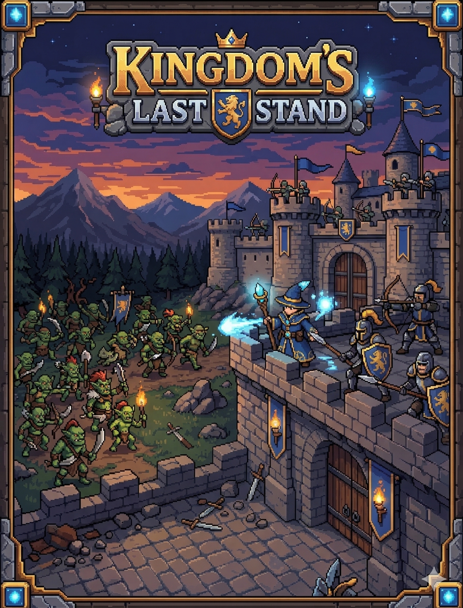
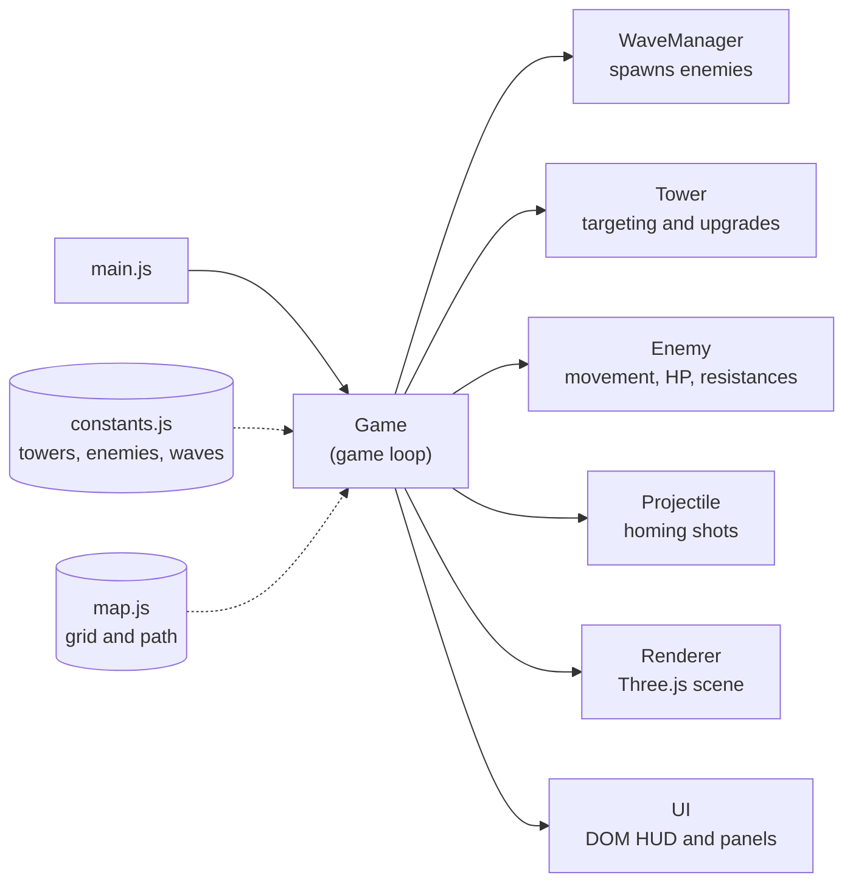

<div align="center">

# 🏰 Kingdom's Last Stand

**A fantasy tower defense game that runs in the browser, built with vanilla JavaScript and Three.js.**

[](https://kingdoms-last-stand.vercel.app/)




</div>

## About

The kingdom is under siege. Goblins, orcs, skeletons, wolves, and bosses march toward your castle across 20 waves. You place towers, choose upgrade paths, and balance your gold to hold the line.

Every tower, upgrade, enemy, and wave is defined as data, and the game logic reads it. That makes the whole game balanceable from a single file.

## Features

- **4 towers, unlocked as the waves progress**

  | Tower | Cost | Damage | Role | Unlocks |
  | --- | --- | --- | --- | --- |
  | 🏹 Archer | 75g | Physical | Fast, single target | Wave 1 |
  | ❄️ Frost | 150g | Magic | Slows enemies | Wave 3 |
  | 🪄 Wizard | 275g | Magic | Splash damage | Wave 5 |
  | 💥 Cannon | 1000g | Physical | Heavy splash, short range | Wave 8 |

- **Two upgrade paths per tower, three tiers each.** You can't take both paths to tier 2 or higher, so every tower becomes a specialization.
- **Damage types and resistances.** Enemies have armor, magic resistance, and slow resistance. An armored orc shrugs off arrows but not spells, so mixing tower types matters.
- **Tower abilities** unlocked through upgrades: multi-shot, critical hits, freezing splash, chain lightning.
- **9 enemy types,** including two mini-bosses, a boss, and the final Overlord on wave 20. Enemies speed up every 5 waves.
- **3 difficulty levels** that change starting gold, enemy HP, rewards, and the map's water layout.
- **Quality-of-life controls:** click or drag to place towers, 2× speed, sell for 60% of the invested cost, and background music.

## Architecture



- **Game loop:** a `requestAnimationFrame` loop updates enemies, towers, and projectiles each frame. The 2× speed setting simply scales the time step (`dt`), so the same logic runs at any speed.
- **Rendering:** a Three.js orthographic camera gives a top-down view. Towers and enemies are drawn as sprites, with procedural 3D shapes as a fallback.
- **Placement:** raycasting converts a mouse click into a cell on a 20×15 grid. Cells on the enemy path are blocked.
- **Damage:** `damage × (1 − resistance)` for the matching damage type. Slow effects are scaled by the enemy's slow resistance.

## Tech stack

- **Language:** vanilla JavaScript (ES modules). No framework and no build step.
- **Rendering:** Three.js 0.160, loaded from a CDN through an import map.
- **Hosting:** Vercel

## Running locally

The game loads ES modules, so it needs to be served over HTTP rather than opened as a file:

```bash
git clone https://github.com/ofriv/Kingdoms-Last-Stand.git
cd Kingdoms-Last-Stand
npx serve .        # or: python -m http.server 8000
```

## Project structure

```
├── index.html          # Page, HUD markup, import map
├── css/style.css
├── assets/
│   ├── audio/          # Background music
│   └── sprites/        # Towers, enemies, castle, start screen
└── js/
    ├── main.js         # Entry point
    ├── game.js         # Game loop, gold, lives, placement
    ├── renderer.js     # Three.js scene, camera, sprites
    ├── ui.js           # HUD, panels, overlays
    ├── waves.js        # Wave spawning
    ├── towers.js       # Towers and upgrade rules
    ├── enemies.js      # Enemy movement and resistances
    ├── projectiles.js  # Homing projectiles
    ├── audio.js        # Music playback
    ├── map.js          # Grid and path
    └── constants.js    # All game data
```

## What I'd improve next

- **Saved progress** and a local high-score table
- **More maps,** plus an endless mode after wave 20
- **Automated tests** for the damage and upgrade rules, which are pure logic and easy to test

## License and credits

The code is released under the [MIT License](LICENSE). The background music was generated with [Suno](https://suno.com) and isn't covered by the MIT license.
